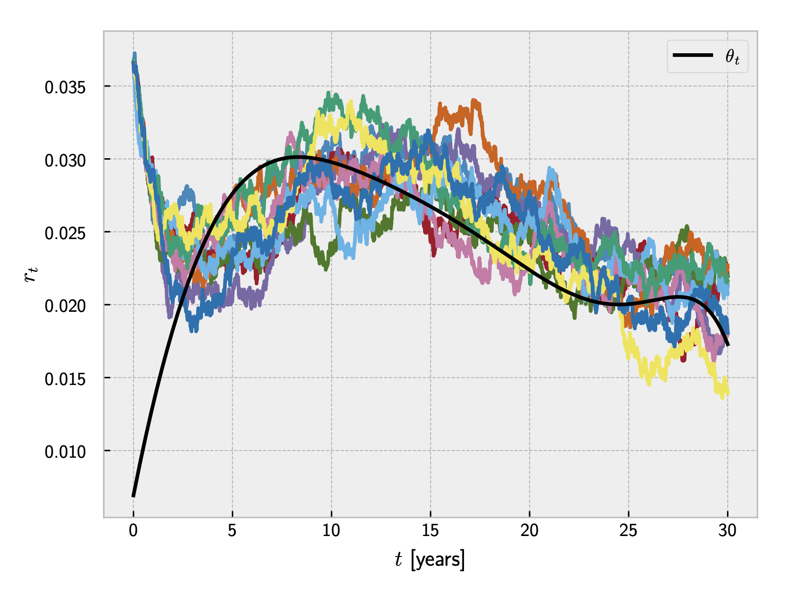

# Application of the Heath-Jarrow-Morton Framework to Pricing Interest Rate Derivatives

## Overview

This repository contains the thesis **"Application of the Heath-Jarrow-Morton Framework to Pricing Interest Rate Derivatives"** and the associated code. The work focuses on the practical application of the Hull-White model from the Heath-Jarrow-Morton (HJM) family for pricing interest rate derivatives such as caplets and swaptions. The thesis bridges the gap between theoretical finance models and real-world market data by implementing, calibrating, and evaluating the model's performance.

**Author**: Ivan Almer  
**Institution**: Bocconi University, Master of Quantitative Finance and Risk Management  
**Supervisor**: Francesco Rotondi  
**Date**: September 8, 2024

## Key Contents

### 1. **Thesis** (`thesis.pdf`)

The thesis provides an in-depth exploration of the Hull-White model, extending the Vasicek short-rate model, to price interest rate derivatives like caplets and swaptions. Below are some of the key sections:

#### **Hull-White Model** 
The Hull-White model is an extension of the Vasicek model with a time-dependent mean reversion level for the short rate $r_t$:

$$dr_t = k(\theta_t - r_t)dt + \sigma dW_t$$

where $\theta_t$ is the time-dependent mean-reversion level derived as:

$$\theta_t = f(0,t) + \frac{1}{k} \frac{\partial f(0,t)}{\partial t} + \frac{\sigma^2}{2k^2} \left(1 - e^{-2kt}\right)$$

This flexibility allows the model to fit the initial term structure of interest rates more accurately.

**Caplet and Cap Pricing**:  
Caplets are priced within the Hull-White framework using the relationship between caplets and zero-coupon bond put options. For example, the price of a caplet can be expressed in terms of the zero-coupon bond put option price:

$$\mathbf{Cpl}(t,T_{i-1},T_i,N,K) = N'\cdot\mathbf{ZBP}(t,T_{i-1},T_i,K')$$

where $ZBP$ represents the zero-coupon bond put option price under the Hull-White model, and the cap price is the sum of its component caplets:

$$\mathbf{Cap}(t,T_b,N,K) = \sum_{i=1}^b \mathbf{Cpl}(t,T_{i-1},T_i,N,K)$$

**Model Calibration**:  
The Hull-White model parameters, specifically the mean reversion rate $k$ and volatility $\sigma$, are calibrated to market data using an optimization process to minimize the error between market-observed caplet prices and model prices. The objective function for calibration is:

$$\mathbf{\Theta} = \arg\min_{(k,\sigma)}\sum_{i=0}^L \left[\mathbf{Cap}^{HW}_i(0,T_b,N,K) - \mathbf{Cap}^{Black}_i(0,T_b,N,K)\right]^2$$

where $\mathbf{Cap}^{HW}$ represents the Hull-White cap prices, and $\mathbf{Cap}^{Black}$ are the market cap prices using Black's model. Below you can find a few generated paths of the the short rate $r_t$ with the calibrated parameters:



**Swaption Pricing**:  
The thesis also delves into swaption pricing using a binomial tree for the short-rate process. The price of a swaption is computed as:

$$Swaption(t) = \mathbb{E}_t^\mathbb{Q} \left[ D(t,T) (IRS(T))^+ \right]$$

where $IRS(T)$ is the value of the interest rate swap at maturity $T$, and the binomial tree is built using the discretized form of the Hull-White process.

**Results**:  
The calibrated model was able to match market prices for interest rate derivatives with high accuracy, particularly for at-the-money and in-the-money swaptions (see the plot below).


The results demonstrate the practicality of the Hull-White model for real-world financial applications, though improvements (e.g., multi-curve frameworks) would further enhance performance.

### 2. **Code** (`notebooks/` folder)

The code accompanying the thesis implements the Hull-White model calibration and swaption pricing, providing a hands-on tool for applying the theoretical concepts discussed in the thesis. It includes:

- **Model Calibration**: Fits the Hull-White model to market cap and swaption data using the Nelder-Mead optimization method.
- **Swaption Pricing**: Builds a binomial tree to represent the short-rate dynamics and prices European swaptions.

You can also access the complete implementation in this Jupyter notebook [here](https://colab.research.google.com/drive/1M-CqLrTAJJ4lelp9nTbWoAhFJPNjVU6T).

## Installation & Usage

To run the notebook and experiment with the code:

1. **Clone this repository**:
   ```bash
   git clone https://github.com/almer101/bocconi-thesis.git
   cd bocconi-thesis
